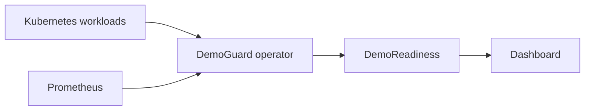

# DemoGuard

DemoGuard is a Kubernetes preflight operator that tells teams whether a workload is safe to demo before they present.

## Why DemoGuard

Demo failures are often predictable, but teams discover the warning signs too late: unsafe rollout settings, missing disruption budgets, undersized resources, restarting pods, unavailable replicas, or a rollout that never completes. DemoGuard evaluates those signals together and records a point-in-time decision before the presentation starts.

## What it checks

| Area | Assessment |
| --- | --- |
| Static configuration | Replica count, readiness probes, resource requests and limits, rolling-update safety, and PodDisruptionBudget coverage |
| Runtime health | Ready and available replicas, pod phases, container restarts, and fatal waiting states such as `CrashLoopBackOff` |
| Forecast signals | CPU and memory usage projected across the configured demo window from Prometheus history |
| Rollout state | Observed generation, updated/Ready/available replicas, and failed-progress conditions |
| Safe remediation | Deterministic review items and YAML where DemoGuard can infer a safe change |
| Preflight result | Ordered checks, summary, final `READY`, `WARNING`, or `BLOCKED` status, and a score |

## Architecture



The operator watches `DemoPolicy` resources, evaluates the target Deployment, and writes a same-namespace `DemoReadiness` resource. The dashboard reads Kubernetes resources and does not query Prometheus directly.

## Demo outcomes

| Scenario | Expected outcome | Meaning |
| --- | --- | --- |
| Healthy deployment | `READY / 100` | Static checks pass, runtime is healthy, and rollout is stable |
| Static-risk deployment | `BLOCKED / 40` | Replica, rollout, and PDB risks produce reviewable remediation plans |
| Stalled rollout | `BLOCKED / 40` | Kubernetes reports `ProgressDeadlineExceeded` |

## Quick start: Kind + Helm

This is the recommended way to run DemoGuard locally.

### Prerequisites

- Docker
- Kind with a cluster named `demoguard`
- `kubectl`
- Helm 3

Build the operator and dashboard images from the repository root:

```bash
docker build -t demoguard-operator:0.1.0 ./operator
docker build -t demoguard-dashboard:0.1.0 ./dashboard
```

Load both images into Kind:

```bash
kind load docker-image demoguard-operator:0.1.0 --name demoguard
kind load docker-image demoguard-dashboard:0.1.0 --name demoguard
```

Install DemoGuard in its own namespace:

```bash
helm install demoguard ./charts/demoguard -n demoguard --create-namespace
```

The chart defaults to `IfNotPresent`, so Kind uses the loaded images. Its default Prometheus endpoint is `http://prometheus-server.monitoring.svc.cluster.local`.

Check the installation:

```bash
kubectl get pods -n demoguard
```

Forward the dashboard and open [http://localhost:8080](http://localhost:8080):

```bash
kubectl -n demoguard port-forward service/demoguard-dashboard 8080:8080
```

## Using the dashboard

Choose a namespace, then select one of its `DemoPolicy` resources. The dashboard displays the latest score, findings, recommendations, forecast and rollout states, and the ordered preflight checks.

**Refresh assessment** patches only the selected policy's `demoguard.dev/refresh` annotation, requesting a new operator reconciliation. For remediation plans with YAML, expand **Review patch YAML** and use **Copy patch** to copy it for external review.

Remediation is review/copy only. DemoGuard never applies changes automatically, and the dashboard has no Apply action.

## Live demo scenarios

The manifests in `config/demo-scenarios/` use real Kubernetes state. Create their namespace once:

```bash
kubectl apply -f config/demo-scenarios/namespace.yaml
```

### Healthy

```bash
kubectl apply -f config/demo-scenarios/healthy.yaml
kubectl rollout status deployment/demoguard-healthy --namespace demoguard-demo --timeout=90s
kubectl annotate demopolicy demoguard-healthy --namespace demoguard-demo demoguard.dev/refresh="$(date +%s)" --overwrite
kubectl get demoreadiness demoguard-healthy-readiness --namespace demoguard-demo -o yaml
```

Expected: `READY / 100`. Without usable Prometheus history, CPU and memory can remain `UNKNOWN` without lowering readiness.

### Static risk

```bash
kubectl apply -f config/demo-scenarios/static-risk.yaml
kubectl get demoreadiness demoguard-static-risk-readiness --namespace demoguard-demo -o yaml
```

Expected: `BLOCKED / 40`, with remediation plans for the unsafe replica, rolling-update, and PDB configuration.

### Stalled rollout

```bash
kubectl apply -f config/demo-scenarios/stalled-rollout.yaml
kubectl get deployment demoguard-stalled-rollout --namespace demoguard-demo --watch
```

After the configured 30-second progress deadline, stop the watch and refresh the assessment:

```bash
kubectl get deployment demoguard-stalled-rollout --namespace demoguard-demo -o jsonpath='{range .status.conditions[*]}{.type}{"\t"}{.status}{"\t"}{.reason}{"\n"}{end}'
kubectl annotate demopolicy demoguard-stalled-rollout --namespace demoguard-demo demoguard.dev/refresh="$(date +%s)" --overwrite
kubectl get demoreadiness demoguard-stalled-rollout-readiness --namespace demoguard-demo -o yaml
```

Expected: `BLOCKED / 40`, rollout status `STALLED`, and a `ProgressDeadlineExceeded` condition. Before the deadline, `ROLLING_OUT` is expected.

Clean up all scenarios and generated readiness resources:

```bash
kubectl delete -f config/demo-scenarios/healthy.yaml --ignore-not-found
kubectl delete -f config/demo-scenarios/static-risk.yaml --ignore-not-found
kubectl delete -f config/demo-scenarios/stalled-rollout.yaml --ignore-not-found
kubectl delete demoreadiness demoguard-healthy-readiness demoguard-static-risk-readiness demoguard-stalled-rollout-readiness --namespace demoguard-demo --ignore-not-found
kubectl delete -f config/demo-scenarios/namespace.yaml --ignore-not-found
```

## Local development

Forward the Prometheus service used by the chart:

```bash
kubectl -n monitoring port-forward service/prometheus-server 9090:80
```

Run the operator against it in another terminal:

```bash
cd operator
PROMETHEUS_URL=http://localhost:9090 mvn exec:java
```

Run the Spring Boot dashboard against the active kubeconfig context:

```bash
kubectl config current-context
cd dashboard
mvn spring-boot:run
```

## Security and permissions

The dashboard ServiceAccount can read namespaces, `DemoPolicy`, and `DemoReadiness` resources. Its only write permission is `patch` on `DemoPolicy`, used to set the refresh annotation.

It cannot modify Deployments, Pods, PodDisruptionBudgets, Secrets, or other workloads. It has no permission to read Secrets.

## Project structure

```text
operator/               Java operator and readiness logic
dashboard/              Spring Boot API and React/TypeScript UI
charts/demoguard/       Helm chart, RBAC, and packaged CRDs
config/crd/             DemoPolicy and DemoReadiness CRDs
config/demo-scenarios/  Controlled live-demo manifests
```

## Testing

```bash
# Operator tests
cd operator && mvn test

# Dashboard tests
cd ../dashboard && mvn test

# Frontend tests and production build
cd frontend && npm install && npm test && npm run build

# Helm validation (from the repository root)
cd ../.. && helm lint ./charts/demoguard

# Container builds
docker build -t demoguard-operator:0.1.0 ./operator
docker build -t demoguard-dashboard:0.1.0 ./dashboard
```

## Limitations

- CPU and memory forecasts depend on the availability and history of the required Prometheus metrics.
- The dashboard is intentionally a point-in-time assessment, not a historical observability platform.
- Local Kind images must be rebuilt and reloaded after code changes.
