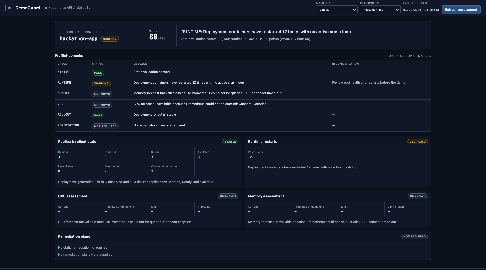
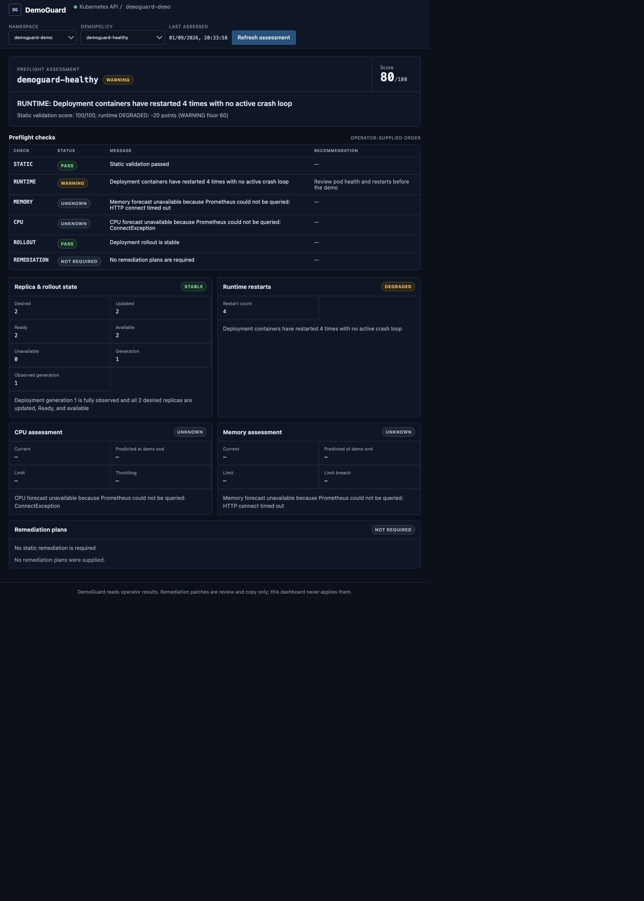
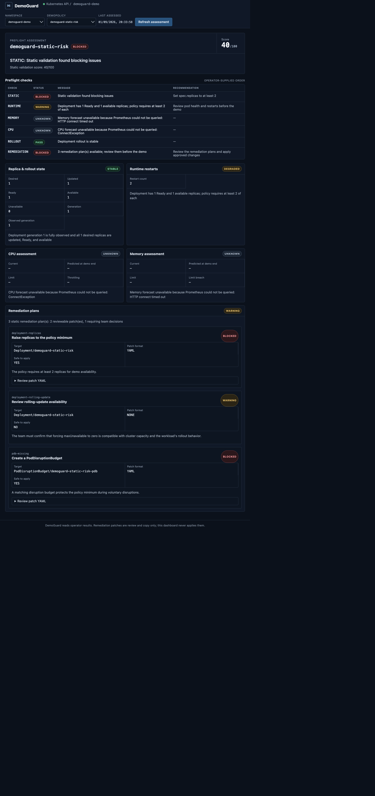
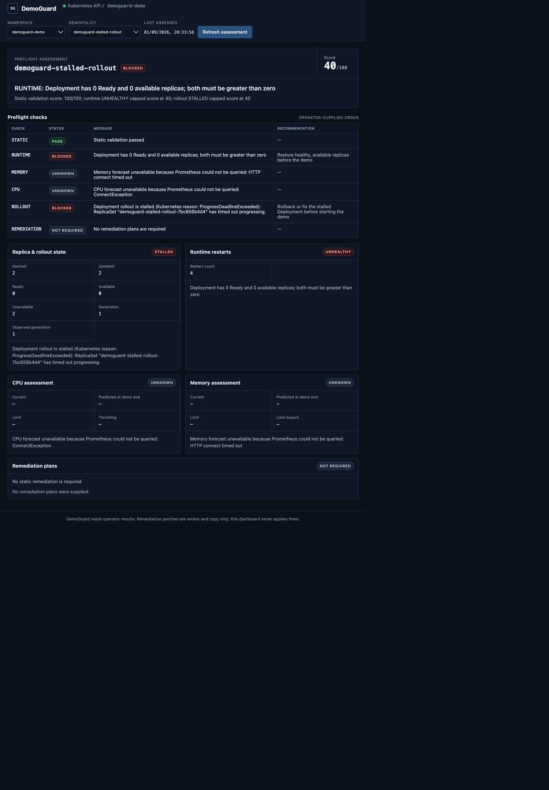

# DemoGuard

DemoGuard is a Kubernetes preflight operator that tells teams whether a workload is safe to demo before they present.

## Install and use DemoGuard

Use these steps after cloning the repository to install DemoGuard and assess one of your own applications.

### 1. Prerequisites

- A Kubernetes cluster
- `kubectl`, configured to access the cluster
- Docker
- Helm 3
- Prometheus (optional, but required for CPU and memory forecasts)
- Kind (only for the local development path below)

### 2. Clone the repository

```bash
git clone https://github.com/Shwetank-Sinha/demoguard.git
cd demoguard
```

### 3. Local Kind installation

Create a Kind cluster named `demoguard` if you do not already have one:

```bash
kind create cluster --name demoguard
```

From the repository root, build both images and load them into the cluster:

```bash
docker build -t demoguard-operator:0.1.0 ./operator
docker build -t demoguard-dashboard:0.1.0 ./dashboard
kind load docker-image demoguard-operator:0.1.0 --name demoguard
kind load docker-image demoguard-dashboard:0.1.0 --name demoguard
```

Install DemoGuard with Helm and verify that its pods are running:

```bash
helm install demoguard ./charts/demoguard -n demoguard --create-namespace
kubectl get pods -n demoguard
```

Forward the dashboard service. Keep this command running while you use the dashboard:

```bash
kubectl -n demoguard port-forward service/demoguard-dashboard 8080:8080
```

Open [http://localhost:8080](http://localhost:8080).

### 4. Create a DemoPolicy for your app

Create `my-app-policy.yaml` with this minimal policy:

```yaml
apiVersion: demoguard.dev/v1alpha1
kind: DemoPolicy
metadata:
  name: my-app
  namespace: default
spec:
  targetNamespace: default
  targetDeployment: my-app
  minimumReplicas: 2
  demoDurationMinutes: 30
```

Replace `my-app` in `targetDeployment` with the name of your Deployment. If the Deployment is in another namespace, change both `metadata.namespace` and `targetNamespace` to that namespace. Then apply the policy:

```bash
kubectl apply -f my-app-policy.yaml
```

### 5. View the result

In the dashboard, select the `default` namespace, select the `my-app` policy, and click **Refresh assessment**.

Alternatively, inspect the generated `DemoReadiness` resource with `kubectl`:

```bash
kubectl get demoreadiness
kubectl get demoreadiness my-app-readiness -o yaml
```

### 6. Using a non-Kind cluster

This repository does not configure a public container registry. Build and push both images to a registry that your cluster can access, then override the chart's image repositories and tags. For example, after pushing both images with the tag `0.1.0`:

```bash
helm install demoguard ./charts/demoguard \
  -n demoguard --create-namespace \
  --set operator.image.repository=YOUR_REGISTRY/demoguard-operator \
  --set operator.image.tag=0.1.0 \
  --set dashboard.image.repository=YOUR_REGISTRY/demoguard-dashboard \
  --set dashboard.image.tag=0.1.0
```

Replace `YOUR_REGISTRY` with the registry path where you pushed the images. Configure registry credentials in the cluster if that registry is private.

### 7. What happens after installation

DemoGuard watches the `DemoPolicy`, evaluates its target Deployment, and writes the result to a `DemoReadiness` resource. The dashboard reads that resource to display the assessment. DemoGuard never changes your workloads automatically.

## Why DemoGuard

Demo failures are often predictable, but teams discover the warning signs too late: unsafe rollout settings, missing disruption budgets, undersized resources, restarting pods, unavailable replicas, or a rollout that never completes. DemoGuard evaluates those signals together and records a point-in-time decision before the presentation starts.

## What it checks

<table style="border-collapse: collapse; width: 100%;">
  <thead>
    <tr style="background: #14213d; color: #ffffff;">
      <th style="border: 1px solid #d0d7de; padding: 6px 13px; text-align: left;">Area</th>
      <th style="border: 1px solid #d0d7de; padding: 6px 13px; text-align: left;">Assessment</th>
    </tr>
  </thead>
  <tbody>
    <tr style="background: #ffffff;"><td style="border: 1px solid #d0d7de; padding: 6px 13px;">Static configuration</td><td style="border: 1px solid #d0d7de; padding: 6px 13px;">Replica count, readiness probes, resource requests and limits, rolling-update safety, and PodDisruptionBudget coverage</td></tr>
    <tr style="background: #ffffff;"><td style="border: 1px solid #d0d7de; padding: 6px 13px;">Runtime health</td><td style="border: 1px solid #d0d7de; padding: 6px 13px;">Ready and available replicas, pod phases, container restarts, and fatal waiting states such as <code>CrashLoopBackOff</code></td></tr>
    <tr style="background: #ffffff;"><td style="border: 1px solid #d0d7de; padding: 6px 13px;">Forecast signals</td><td style="border: 1px solid #d0d7de; padding: 6px 13px;">CPU and memory usage projected across the configured demo window from Prometheus history</td></tr>
    <tr style="background: #ffffff;"><td style="border: 1px solid #d0d7de; padding: 6px 13px;">Rollout state</td><td style="border: 1px solid #d0d7de; padding: 6px 13px;">Observed generation, updated/Ready/available replicas, and failed-progress conditions</td></tr>
    <tr style="background: #ffffff;"><td style="border: 1px solid #d0d7de; padding: 6px 13px;">Safe remediation</td><td style="border: 1px solid #d0d7de; padding: 6px 13px;">Deterministic review items and YAML where DemoGuard can infer a safe change</td></tr>
    <tr style="background: #ffffff;"><td style="border: 1px solid #d0d7de; padding: 6px 13px;">Preflight result</td><td style="border: 1px solid #d0d7de; padding: 6px 13px;">Ordered checks, summary, final <code>READY</code>, <code>WARNING</code>, or <code>BLOCKED</code> status, and a score</td></tr>
  </tbody>
</table>

## Architecture

```text
Kubernetes workloads ─┐
                      ├─> DemoGuard operator ─> DemoReadiness ─> Dashboard
Prometheus ───────────┘
```

The operator is the source of truth, and the dashboard does not query Prometheus directly.

## Demo outcomes

<table style="border-collapse: collapse; width: 100%;">
  <thead>
    <tr style="background: #14213d; color: #ffffff;">
      <th style="border: 1px solid #d0d7de; padding: 6px 13px; text-align: left;">Scenario</th>
      <th style="border: 1px solid #d0d7de; padding: 6px 13px; text-align: left;">Expected outcome</th>
      <th style="border: 1px solid #d0d7de; padding: 6px 13px; text-align: left;">Meaning</th>
    </tr>
  </thead>
  <tbody>
    <tr style="background: #ffffff;"><td style="border: 1px solid #d0d7de; padding: 6px 13px;">Healthy deployment</td><td style="border: 1px solid #d0d7de; padding: 6px 13px;"><code>READY / 100</code></td><td style="border: 1px solid #d0d7de; padding: 6px 13px;">Static checks pass, runtime is healthy, and rollout is stable</td></tr>
    <tr style="background: #ffffff;"><td style="border: 1px solid #d0d7de; padding: 6px 13px;">Static-risk deployment</td><td style="border: 1px solid #d0d7de; padding: 6px 13px;"><code>BLOCKED / 40</code></td><td style="border: 1px solid #d0d7de; padding: 6px 13px;">Replica, rollout, and PDB risks produce reviewable remediation plans</td></tr>
    <tr style="background: #ffffff;"><td style="border: 1px solid #d0d7de; padding: 6px 13px;">Stalled rollout</td><td style="border: 1px solid #d0d7de; padding: 6px 13px;"><code>BLOCKED / 40</code></td><td style="border: 1px solid #d0d7de; padding: 6px 13px;">Kubernetes reports <code>ProgressDeadlineExceeded</code></td></tr>
  </tbody>
</table>

## Quick start: Kind + Helm

This is the recommended way to run DemoGuard locally.

### Prerequisites

- Docker
- Kind with a cluster named `demoguard`
- `kubectl`
- Helm 3

Build the operator and dashboard images from the repository root:

```bash
docker build -t demoguard-operator:0.1.0 ./operator
docker build -t demoguard-dashboard:0.1.0 ./dashboard
```

Load both images into Kind:

```bash
kind load docker-image demoguard-operator:0.1.0 --name demoguard
kind load docker-image demoguard-dashboard:0.1.0 --name demoguard
```

Install DemoGuard in its own namespace:

```bash
helm install demoguard ./charts/demoguard -n demoguard --create-namespace
```

The chart defaults to `IfNotPresent`, so Kind uses the loaded images. Its default Prometheus endpoint is `http://prometheus-server.monitoring.svc.cluster.local`.

Check the installation:

```bash
kubectl get pods -n demoguard
```

Forward the dashboard and open [http://localhost:8080](http://localhost:8080):

```bash
kubectl -n demoguard port-forward service/demoguard-dashboard 8080:8080
```

## Using the dashboard

Choose a namespace, then select one of its `DemoPolicy` resources. The dashboard displays the latest score, findings, recommendations, forecast and rollout states, and the ordered preflight checks.

**Refresh assessment** patches only the selected policy's `demoguard.dev/refresh` annotation, requesting a new operator reconciliation. For remediation plans with YAML, expand **Review patch YAML** and use **Copy patch** to copy it for external review.

Remediation is review/copy only. DemoGuard never applies changes automatically, and the dashboard has no Apply action.

## Live dashboard results

These screenshots show real, operator-backed `DemoReadiness` assessments from a Kubernetes cluster, not mock dashboard states. The dashboard reads the status published by the DemoGuard operator and does not invent results.

<details>
  <summary>Existing workload (`default` namespace) — WARNING · 80/100</summary>
  <br />
  <p>DemoGuard detected historical container restarts while replicas and rollout remained safe.</p>
  
</details>

<details>
  <summary>Healthy scenario with historical restarts — WARNING · 80/100</summary>
  <br />
  <p>Static checks passed and the rollout was stable, but four historical container restarts produced a runtime warning.</p>
  
</details>

<details>
  <summary>Static configuration risk — BLOCKED · 40/100</summary>
  <br />
  <p>The Deployment violated safety requirements, and DemoGuard produced real, reviewable remediation plans.</p>
  
</details>

<details>
  <summary>Stalled rollout — BLOCKED · 40/100</summary>
  <br />
  <p>Kubernetes reported <code>ProgressDeadlineExceeded</code>, and DemoGuard marked the rollout STALLED.</p>
  
</details>

## Live demo scenarios

The manifests in `config/demo-scenarios/` use real Kubernetes state. Create their namespace once:

```bash
kubectl apply -f config/demo-scenarios/namespace.yaml
```

### Healthy

```bash
kubectl apply -f config/demo-scenarios/healthy.yaml
kubectl rollout status deployment/demoguard-healthy --namespace demoguard-demo --timeout=90s
kubectl annotate demopolicy demoguard-healthy --namespace demoguard-demo demoguard.dev/refresh="$(date +%s)" --overwrite
kubectl get demoreadiness demoguard-healthy-readiness --namespace demoguard-demo -o yaml
```

Expected: `READY / 100`. Without usable Prometheus history, CPU and memory can remain `UNKNOWN` without lowering readiness.

### Static risk

```bash
kubectl apply -f config/demo-scenarios/static-risk.yaml
kubectl get demoreadiness demoguard-static-risk-readiness --namespace demoguard-demo -o yaml
```

Expected: `BLOCKED / 40`, with remediation plans for the unsafe replica, rolling-update, and PDB configuration.

### Stalled rollout

```bash
kubectl apply -f config/demo-scenarios/stalled-rollout.yaml
kubectl get deployment demoguard-stalled-rollout --namespace demoguard-demo --watch
```

After the configured 30-second progress deadline, stop the watch and refresh the assessment:

```bash
kubectl get deployment demoguard-stalled-rollout --namespace demoguard-demo -o jsonpath='{range .status.conditions[*]}{.type}{"\t"}{.status}{"\t"}{.reason}{"\n"}{end}'
kubectl annotate demopolicy demoguard-stalled-rollout --namespace demoguard-demo demoguard.dev/refresh="$(date +%s)" --overwrite
kubectl get demoreadiness demoguard-stalled-rollout-readiness --namespace demoguard-demo -o yaml
```

Expected: `BLOCKED / 40`, rollout status `STALLED`, and a `ProgressDeadlineExceeded` condition. Before the deadline, `ROLLING_OUT` is expected.

Clean up all scenarios and generated readiness resources:

```bash
kubectl delete -f config/demo-scenarios/healthy.yaml --ignore-not-found
kubectl delete -f config/demo-scenarios/static-risk.yaml --ignore-not-found
kubectl delete -f config/demo-scenarios/stalled-rollout.yaml --ignore-not-found
kubectl delete demoreadiness demoguard-healthy-readiness demoguard-static-risk-readiness demoguard-stalled-rollout-readiness --namespace demoguard-demo --ignore-not-found
kubectl delete -f config/demo-scenarios/namespace.yaml --ignore-not-found
```

## Local development

Forward the Prometheus service used by the chart:

```bash
kubectl -n monitoring port-forward service/prometheus-server 9090:80
```

Run the operator against it in another terminal:

```bash
cd operator
PROMETHEUS_URL=http://localhost:9090 mvn exec:java
```

Run the Spring Boot dashboard against the active kubeconfig context:

```bash
kubectl config current-context
cd dashboard
mvn spring-boot:run
```

## Security and permissions

The dashboard ServiceAccount can read namespaces, `DemoPolicy`, and `DemoReadiness` resources. Its only write permission is `patch` on `DemoPolicy`, used to set the refresh annotation.

It cannot modify Deployments, Pods, PodDisruptionBudgets, Secrets, or other workloads. It has no permission to read Secrets.

## Project structure

```text
operator/               Java operator and readiness logic
dashboard/              Spring Boot API and React/TypeScript UI
charts/demoguard/       Helm chart, RBAC, and packaged CRDs
config/crd/             DemoPolicy and DemoReadiness CRDs
config/demo-scenarios/  Controlled live-demo manifests
```

## Testing

```bash
# Operator tests
cd operator && mvn test

# Dashboard tests
cd ../dashboard && mvn test

# Frontend tests and production build
cd frontend && npm install && npm test && npm run build

# Helm validation (from the repository root)
cd ../.. && helm lint ./charts/demoguard

# Container builds
docker build -t demoguard-operator:0.1.0 ./operator
docker build -t demoguard-dashboard:0.1.0 ./dashboard
```

## Limitations

- CPU and memory forecasts depend on the availability and history of the required Prometheus metrics.
- The dashboard is intentionally a point-in-time assessment, not a historical observability platform.
- Local Kind images must be rebuilt and reloaded after code changes.
